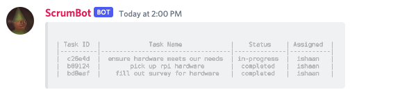

# Scrum Bot

This bot tracks various tasks for you on a discord server!

This bot creates an auto-resizing markdown table given your commands, viewable either as an image or as a text markdown table!

If viewing as markdown, lines can overflow, and mobile users will be unable to view the markdown table reasonably. That is why I've also implemented an image upload!

## Bot Commands

!task [name] - creates a new task with status todo assigned to null

!remove [taskID] - deletes a task

!status [taskID] [status] - sets state of task to [status]

!assign [taskID] [user] - assigns specific user to task with taskID

!tasklist - uploads an image of the product backlog

!mdlist - prints out the product backlog in md format

## Setup

Fork this repository and create a heroku account. Add the repo to heroku and add the redis to go addon.

### Set your GRADLE_TASK to "build"

heroku config:set GRADLE_TASK="build" -a your_app_name

### Set your BOT_TOKEN to your bot token

heroku config:set BOT_TOKEN=[bot token here]

### Set your REDISTOGO_URL

heroku config:set REDISTOGO_URL=[url goes here]

### enable your worker

heroku ps:scale worker=1 -a your_app_name

Set your heroku config variables for both your REDISTOGO_URL (by following the link on the resources page) variable as well as your BOT_TOKEN (from discord) variable.

When you're done, deploy the bot on the deploy page!

Should work right out of the box.
