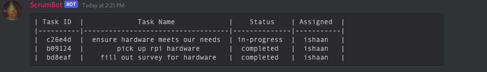

# Scrum Bot

This bot tracks various tasks for you on a discord server! An automated scrum master, unforgiving, cold and calculated.

This bot creates an auto-resizing markdown table given your commands, it will definitely be limited in its ability. Mobile users won't be able to decipher what it posts, and if given too much input, it will overflow no matter what.

In the future, perhaps an image will be posted when !tasklist is called, thus allowing everyone to enjoy this overlord.

## Bot Commands

!task [name] - creates a new task with status todo assigned to null

!remove [taskID] - deletes a task

!status [taskID] [status] - sets state of task to [status]

!assign [taskID] [user] - assigns specific user to task with taskID

!tasklist - prints out the product backlog

## Setup

You'll need to set up Heroku and add the app redis to set up this bot. With trouble-shooting and persistence, it should work right out of the box once you get the environment set up. 